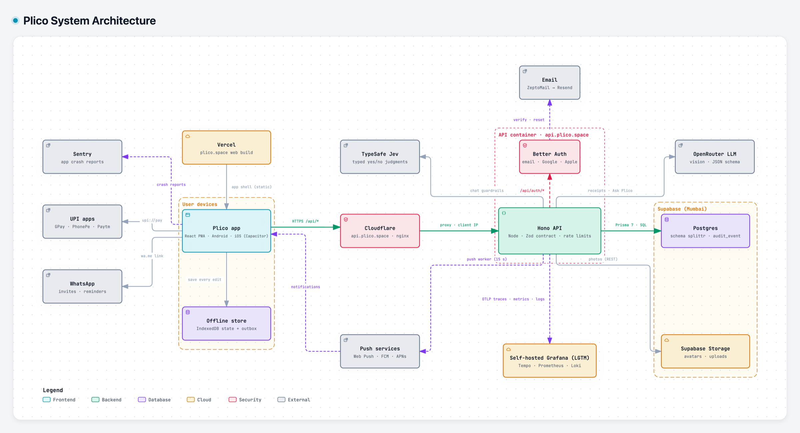
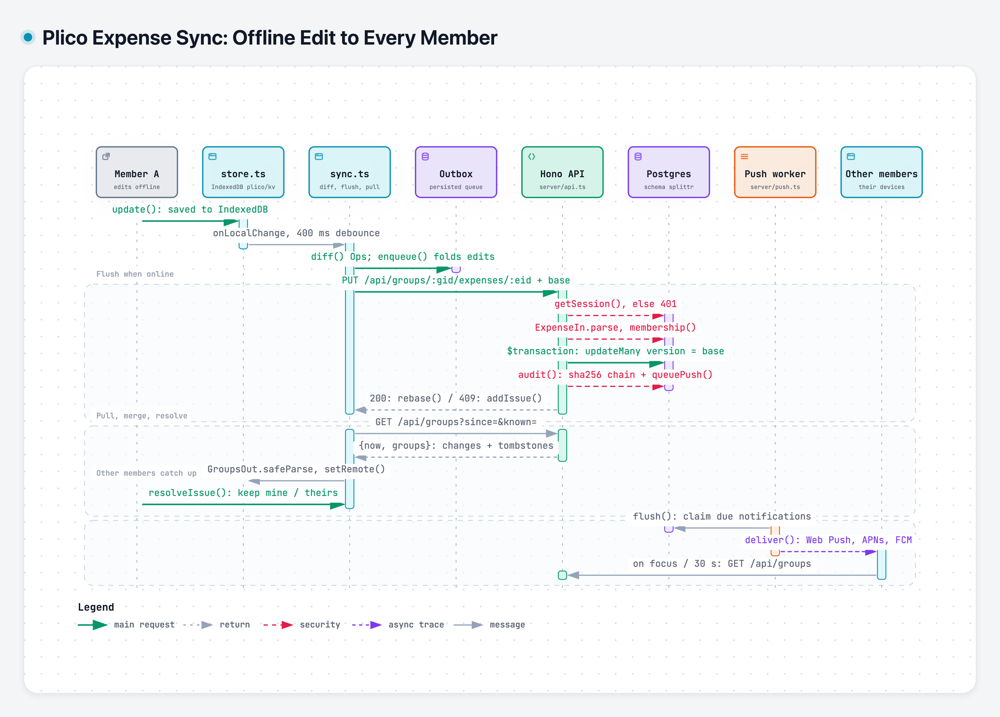
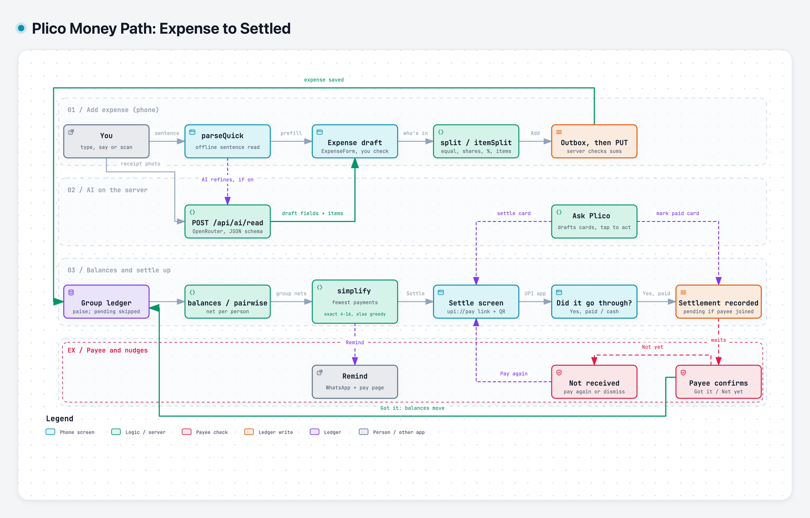

# Plico

Split shared expenses with your group, see who owes whom, and settle over UPI.

Plico is a shared-money app for how Indian groups actually pay: friends on trips, flatmates, couples, families and
office teams. Add an expense in seconds (even offline), let everyone see clear balances, and close the loop with a
`upi://pay` link or QR code. People who never install the app can still take part through WhatsApp links.

One React codebase ships as a web app (PWA) and, wrapped with Capacitor, as Android and iOS apps.

## Features

- **Offline-first ledger**: every edit is saved on the device and synced through an outbox, with conflict handling
  and a hash-chained audit log of who changed what.
- **Settle up over UPI**: payment links and QR codes for any UPI app; the fewest payments to square a group.
- **Guests**: add people by name; they can view and pay through a link without an account.
- **Receipt and sentence capture**: photograph a bill or type "dinner 2400, split with Riya and Sam" and get a draft
  expense (via an LLM; nothing is saved without you).
- **Ask Plico**: a chat that answers questions about your balances and can make changes, each behind a confirm card.
- **Group modes and themes**: Trip, Home, Couple, Family, Friends, Office; each group can look different.
- **Push notifications, reminders, widgets and share-to-Plico** on Android and iOS.

## Quick start

You need **Node 24** and a **Postgres** database. Plico keeps everything in its own `splittr` schema, so it can share
a database with other apps.

```sh
git clone https://github.com/criox4/plico.git && cd plico
npm install                  # also generates the Prisma client
cp .env.example .env         # then fill in DATABASE_URL, DIRECT_URL and BETTER_AUTH_SECRET
npm run db:migrate           # creates the splittr schema and tables
npm run server               # API on http://localhost:8787
npm run dev                  # app on http://localhost:5173 (proxies /api to the API)
```

Open http://localhost:5173 and create an account. Email, file uploads, AI capture, Google sign-in and push
notifications are optional: each switches on when its keys are present in `.env` (see `.env.example`).

## Tests

```sh
npm test          # money maths, splits, parsing, themes, push and chat (plain Node asserts, no framework)
npm run build     # type-check and production build
```

## Phone apps

```sh
VITE_API_URL=https://your-api.example npm run android   # builds, syncs and opens Android Studio
VITE_API_URL=https://your-api.example npm run ios       # same for Xcode
```

The native apps talk to the API over HTTPS with bearer tokens, so they need a deployed API URL.

## How it fits together

<picture>
  <source media="(prefers-color-scheme: dark)" srcset="docs/diagrams/architecture-dark.png">
  
</picture>

One app for web, Android and iOS keeps every edit on the device first. The API is the only thing that talks to the
database and storage; AI, email and push are optional services it calls.

### An edit, from one phone to everyone

<picture>
  <source media="(prefers-color-scheme: dark)" srcset="docs/diagrams/sync-dark.png">
  
</picture>

Edits never wait for the network. The outbox sends each change with the version it was based on; the server applies
it only if nobody changed that expense in between, otherwise the app asks you which version to keep.

### The money path

<picture>
  <source media="(prefers-color-scheme: dark)" srcset="docs/diagrams/settle-dark.png">
  
</picture>

Interactive versions with source links: [`docs/diagrams/`](docs/diagrams/) (open the `.html` files in a browser).

### Stack

| Part | Stack | Where |
|---|---|---|
| App | React 19, TypeScript, Vite, Capacitor 8, Motion | `src/` |
| API | Hono on Node, Zod contract shared with the app | `server/` |
| Auth | Better Auth (email + password, Google, Apple) | `server/auth.ts` |
| Data | Postgres via Prisma 7, schema `splittr`, hand-written migrations | `prisma/` |
| Observability | OpenTelemetry (API), Sentry (app), optional self-hosted Grafana stack | `ops/observability/` |

More detail:

- [docs/architecture.md](docs/architecture.md): the system, the choices and why
- [docs/user-flow.md](docs/user-flow.md): screens and flows
- [docs/deploy.md](docs/deploy.md): branches, CI, deploying the web app and the API
- [docs/observability.md](docs/observability.md): logs, traces, metrics and crash reports
- [docs/compliance/](docs/compliance/): privacy and store disclosures

## Contributing

Issues and pull requests are welcome. Work happens on `dev`; `main` is what's deployed. Commits follow
[Conventional Commits](https://www.conventionalcommits.org/) (`feat(sync): …`, `fix(ui): …`). Please run `npm test`
and `npm run build` before opening a PR.

## License

[AGPL-3.0](LICENSE). You can use, change and self-host Plico; if you offer a modified version as a service, share
your changes under the same license.
